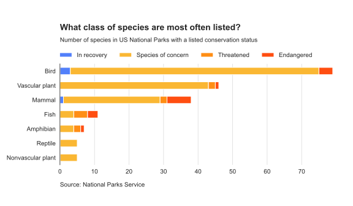

# Tim Vlek - Data scientist

**Data is a passion.**

## Data analyst / Data scientist

I'm Tim, a self-trained data scientist focused on transforming raw data into actionable insights through data analysis, visualization, and machine learning.

I enjoy uncovering patterns in complex datasets and communicating findings through clear, compelling visuals. My work emphasizes clean, structured, and reproducible projects, from data preparation through to model evaluation.

I’m particularly interested in applying data science to real-world problems in energy, climate, and sustainability, where data-driven insights can support meaningful impact.

Feel free to explore my projects below to see my work in practice. I’m always open to feedback, questions, and discussions about potential opportunities.

## Core skills

- Data cleaning & preprocessing
- Feature engineering
- Exploratory analysis & visualization
- Machine learning & predictive modeling
- Model evaluation & performance metrics
- Insight communication & storytelling

## Technical skills

- **Programming:*- Python, SQL, R, Markdown, HTML, CSS
- **Data analysis:*- pandas, numpy
- **Data visualization:*- matplotlib, seaborn, plotly
- **Statistical analysis:*- scipy, statsmodels
- **Machine learning:*- scikit-learn, PyTorch, fastai
- **Big data:*- PySpark
- **Business intelligence (BI):*- Excel, PowerBI, Tableau, Qlik Sense
- **Tools:*- Jupyter Notebook, Git, Poetry

## Featured projects

- [Marketing data analyst](https://github.com/timvlek/marketing-data-analyst): analysis of customer and marketing data to uncover behavioral patterns and relationships between features. Focused on exploratory data analysis, statistical summaries, and clear data visualization to generate actionable insights.

- [Biodiversity in national parks](https://github.com/timvlek/biodiversity-in-national-parks): exploratory analysis of biodiversity data across national parks to understand species distribution and conservation patterns. Includes data cleaning, aggregation, and visualization of ecological trends.

- [Museums and nature centers](https://github.com/timvlek/museums-and-nature-centers): analysis of public cultural and environmental sites to explore geographic distribution and accessibility patterns. Focus on data cleaning, mapping insights, and categorical analysis.

- [OKCupid: data a scientist](https://github.com/timvlek/okcupid-date-a-scientist): analysis of user profile data to explore patterns in dating preferences and behaviors. Includes feature engineering, exploratory analysis, and classification-based insights using machine learning techniques.

- [Yelp regression](https://github.com/timvlek/yelp-regression):egression analysis on Yelp data to predict business ratings based on review and business attributes. Focus on feature engineering, model building, and performance evaluation.

## Contact
- **Email:*- tim.vlek@hotmail.com
- **GitHub:*- https://github.com/timvlek
- **LinkedIn:*- https://www.linkedin.com/in/tim-vlek
