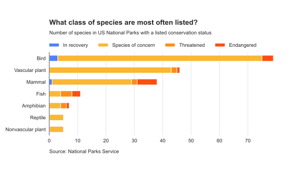

# Tim Vlek - Data Scientist

**Data is my passion.** I enjoy exploring new techniques and implementing them. I'm particularly interested in data visualization and machine learning.

[assets/images/Stacked_barplot_of_class_counts_vs_conservation_status]

### About Me
Data Scientist with a passion for data visualization and machine learning. I love diving into complex datasets to uncover insights and build predictive models. With a background in energy science and innovation management, I bring a unique perspective to data-driven problem-solving. 

### Skills
* **Technical Skills:** Python, pandas, numpy, matplotlib, seaborn, sklearn, fastai, Pyspark, SQL, R
* **Tools:** Jupyter Notebook, Git, Markdown

### Projects
* **To Do:** To Do:. [Link to GitHub repo]
* **To Do:** To Do:. [Link to GitHub repo]

### Contact
* **Email:** tim.vlek@hotmail.com
* **GitHub:** https://github.com/timvlek
* **LinkedIn:** https://www.linkedin.com/in/tim-vlek/
